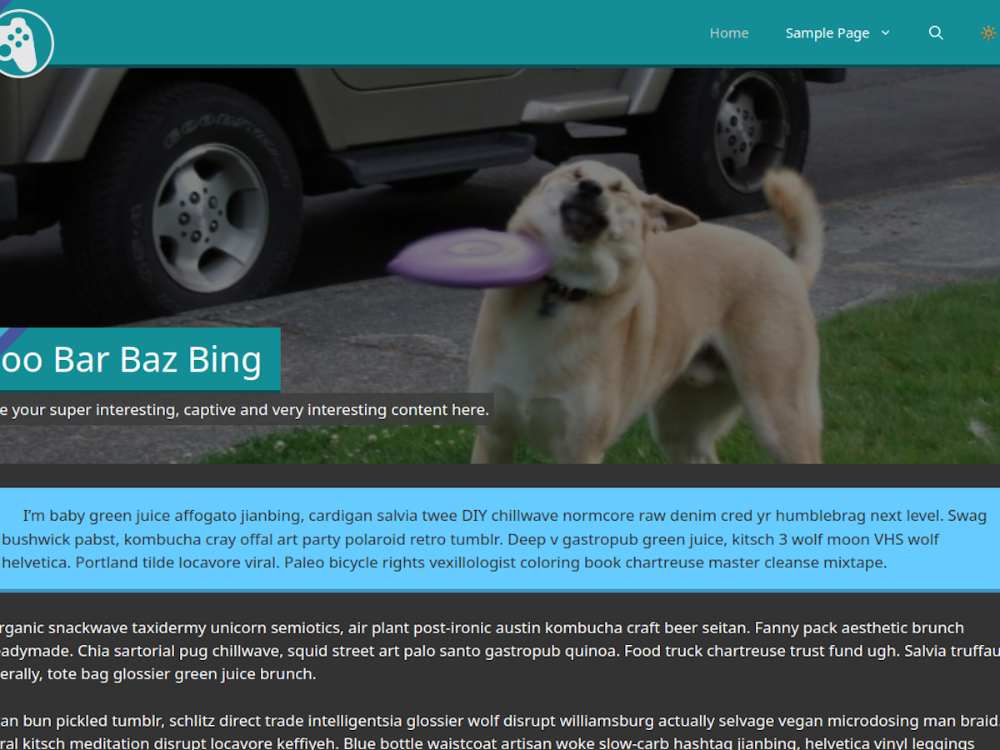

# 📼 Modoki for ReviveToday
Subtle but important changes in the sake of functionality from [the previous design](https://github.com/ReviveToday/sparkling-child).

This theme is built to depend on [**GeneratePress**](https://generatepress.com/). The **[FontAwesome plugin is required](https://en-gb.wordpress.org/plugins/font-awesome/)** for shareblocks and alerts to show correctly.

# Functionality
## 🕰️ Shareblocks & Last Updated Display

Optional per-page feature to show the last updated date of the content, and/or common social media share blocks. **On browsers with agressive ad-blockers, the shareblocks may not show up correctly.**

## 🌚 Dark Mode

A dark mode switch is now integrated into the toolbar alongside search. This will toggle the `dark-mode` class on the `body` tag.

## ⚠ Alert boxes

A great way to highlight some important information. Add a custom `rt-alert` class to a paragraph block, with the addition of `info`, `success`, `warning` or `error`.

## 💥 Pop Banner

A similar looking homepage banner image can be achieved with the **Cover** block, a couple of **Paragraph** blocks, and these lovely additional CSS classes. `rt-pop` will make the button-styled pop-out header, and `rt-enhance` will surround the box in a slightly transparent black square. Whatever page set to **homepage** will have all top-level padding removed, so the cover image can go up against the header bar.
